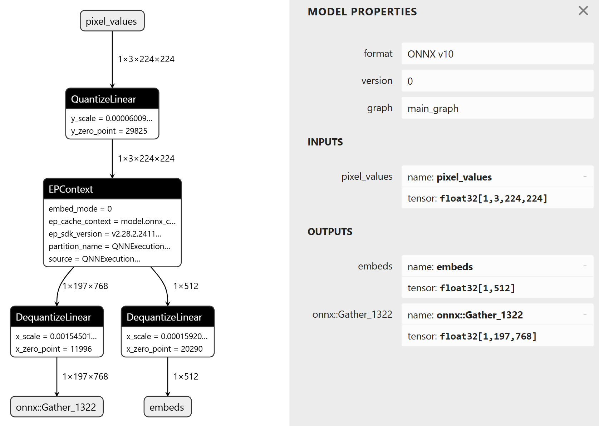
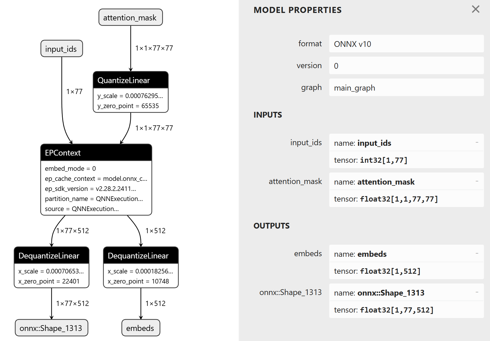

# OpenAI CLIP Quantization

## Prepare Environment

Create `conda` environment and install dependencies with `poetry`.

```bash
conda create -f environment.yml -n {conda_env_name}
conda activate {conda_env_name}
poetry install
```

## Quantization

Quantize `openai/clip-vit-base-patch16` with Olive.

### Image Encoder

```bash
> olive run --config ./openai_clip_vision_b16_qdq.json

+------------+-------------------+------------------------+----------------+-----------------------------+
| model_id   | parent_model_id   | from_pass              |   duration_sec | metrics                     |
+============+===================+========================+================+=============================+
| 190617be   |                   |                        |                |                             |
+------------+-------------------+------------------------+----------------+-----------------------------+
| 1d60606a   | 190617be          | onnxconversion         |           6.01 |                             |
+------------+-------------------+------------------------+----------------+-----------------------------+
| c33b6347   | 1d60606a          | dynamictofixedshape    |           2.04 |                             |
+------------+-------------------+------------------------+----------------+-----------------------------+
| 075566f5   | c33b6347          | qnnpreprocess          |           1.84 |                             |
+------------+-------------------+------------------------+----------------+-----------------------------+
| cf8c3a14   | 075566f5          | onnxstaticquantization |          36.35 |                             |
+------------+-------------------+------------------------+----------------+-----------------------------+
| 434f76bf   | cf8c3a14          | qnpuepcontextgenerator |           4.12 | {                           |
|            |                   |                        |                |   "latency-avg": "18.3784", |
|            |                   |                        |                |   "latency-p75": "18.2094", |
|            |                   |                        |                |   "latency-p90": "18.3473"  |
|            |                   |                        |                | }                           |
+------------+-------------------+------------------------+----------------+-----------------------------+
```



### Text Encoder

```bash
> olive run --config ./openai_clip_text_b16_qdq.json

+------------+-------------------+------------------------+----------------+----------------------------+
| model_id   | parent_model_id   | from_pass              |   duration_sec | metrics                    |
+============+===================+========================+================+============================+
| 09ada6dc   |                   |                        |                |                            |
+------------+-------------------+------------------------+----------------+----------------------------+
| 7178ba23   | 09ada6dc          | onnxconversion         |           5.98 |                            |
+------------+-------------------+------------------------+----------------+----------------------------+
| f40b314c   | 7178ba23          | dynamictofixedshape    |           3.09 |                            |
+------------+-------------------+------------------------+----------------+----------------------------+
| 868043c6   | f40b314c          | qnnpreprocess          |           2.97 |                            |
+------------+-------------------+------------------------+----------------+----------------------------+
| 0ff4d4be   | 868043c6          | onnxstaticquantization |          20.20 |                            |
+------------+-------------------+------------------------+----------------+----------------------------+
| a253cfe0   | 0ff4d4be          | qnpuepcontextgenerator |           2.69 | {                          |
|            |                   |                        |                |   "latency-avg": "5.1520", |
|            |                   |                        |                |   "latency-p75": "5.2294", |
|            |                   |                        |                |   "latency-p90": "5.3862"  |
|            |                   |                        |                | }                          |
+------------+-------------------+------------------------+----------------+----------------------------+
```



## Evaluation

TODO

## Demo

```bash
python ./demo.py --image-file ./cat.jpg --caption "a photo of two cats"
```
