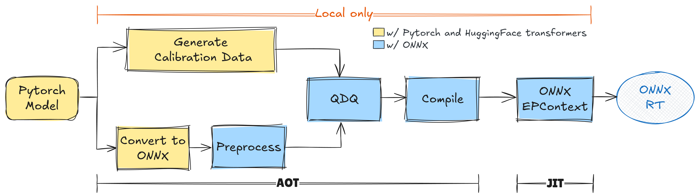

# Llama 3.2

## Set up Environment with Conda and Poetry

```bash
# create a new conda environment with environment.yml
conda env create -f environment.yml -n {env_name}
conda activate {env_name}

# install dependencies with poetry
cd ./models/llm/llama
poetry install
```

### Test Environment

```bash
# run inference with the workflow
python ./main.py --inference

# or try out each module separately
cd /path/to/repo
python -m models.llm.llama.convert_onnx --inference
```

### VSCode Extensions

- [Better TOML](https://marketplace.visualstudio.com/items?itemName=bungcip.better-toml)
- [Command Variable](https://marketplace.visualstudio.com/items?itemName=rioj7.command-variable)

## Quantize Llama-3.2-1B-Instruct



### Run the whole workflow (~20mins)

```bash
# or cd to /path/to/repo
cd /path/to/repo/models/llm/llama

# use --all to run the whole workflow, including generating calibration data, converting to ONNX, and quantizing
# use --model-dir to specify the model output directory, otherwise to `pwd`
# use --data-dir to specify the calibration data output directory, otherwise to `pwd`
# use -h to see more options
python ./main.py --all --model-dir /path/to/repo
```

### Step by Step

#### Generate Calibration Data

```bash
# use --max-calib-len to specify the maximum length of calibration data, default is 32
python ./models/llm/llama/main.py --gen-calib-data
```

#### Convert PyTorch model to ONNX

```bash
# use --skip-prefill or --skip-decode to skip the corresponding part
python ./models/llm/llama/main.py --convert-onnx
```

#### Quantize ONNX Model

```bash
# use --node_optimization to skip certain nodes
python ./models/llm/llama/main.py --quantize-qdq
```

## Infer the Quantized Model with QNPU

```bash
# use --prompt to specify the prompt, otherwise use the default ones
# use --profile to enable profiling (by QNN)
python ./models/llm/llama/infer_qnpu.py --prompt "Hello, world!"
```

## Debugging with VSCode

Predefined configurations in `.vscode/launch.json`

- "**Python Debugger: Llama QDQ**": Debug the whole workflow, need to specify args in .vscode/launch.json
- "**Python Debugger: Current Module**": Debug module separately (e.g. convert_onnx.py, **requires [Command Variable](#vscode-extensions)**)

## TODO

- [ ] Tweak model inputs/outputs, e.g. using StaticCache
- [ ] Set up evaluation pipeline
- [ ] Allow specifying calibration dataset
- [ ] Share weights between prefill and decode
- [ ] Try out different data types for quantization, e.g. int8, int16
- [ ] Support meta-llama/Llama-3.2-3B-Instruct
- [ ] Support meta-llama/Llama-3.2-11B-Vision-Instruct
- [ ] Adopt Ruff and PDM as code formatter and package manager
- [ ] Integrate with [Olive](https://github.com/microsoft/Olive/)
